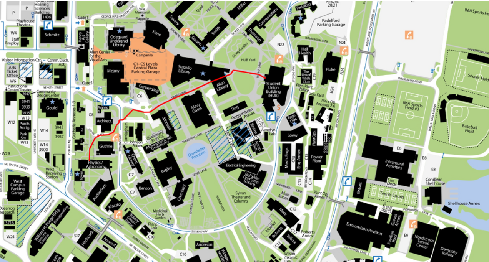

# campuspaths
A web application that can show the shortest distance between any two buildings on the UW campus. Part of a [homework](https://courses.cs.washington.edu/courses/cse331/21wi/hws/hw9/hw-campuspaths.html#Submission) offered in the 21wi rendition of CSE 331 at UW Seattle. Here's how you can navigate this directory:

## The App
This app allows users to input the name of two buildings on campus, and click a Submit button. Then, the shortest path will show up as so:

The user can then click a Clear button to empty the input and clear the path. 

## Frontend
hw-campuspaths holds the front end for the application, with components for showing the map,
path, and processing user inputs.

## Backend
There are several layers to the backend of this project. 

hw-campuspaths holds the Spark Java logic that can communicate between the frontend and the graph in the backend. 

hw-pathfinder holds the algorithm that can perform Djikstra's on any two nodes in a graph, enabling the application to show the shortest possible path. It also holds a graph representing the campus, with nodes as buildings and edges as walkways. 

hw-graph represents a generic graph. 

## How to Run
First, run the hw-campuspaths-server:runSpark gradle task to start the server. Then, go into the hw-campuspaths directory, run npm install, and then run npm start. Finally, you can go to localhost to see and interact with the application.
